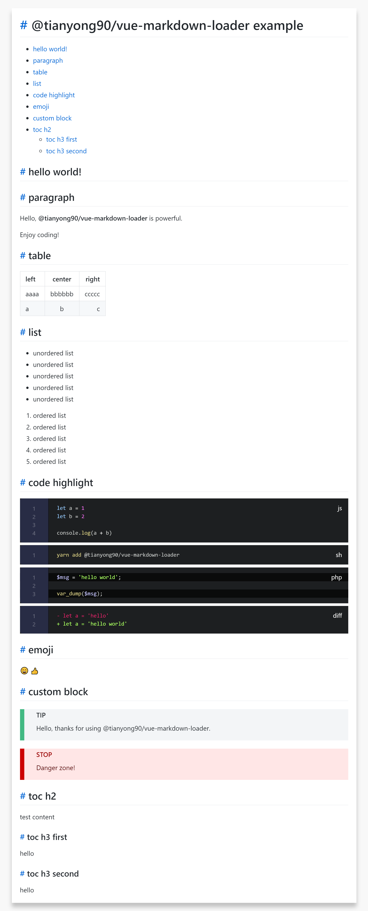

# vue-markdown-loader

[ENGLISH](./README.md)

这是一个 Webpack loader，用于加载 markdown 文件。通过适当的配置，可以将 markdown 文件内容转换为一 vue sfc 组件对象或者 html 内容，此外还可以直接转换为一个包含解析结果、frontmatter 等数据的对象，因此，它可以很方便的与 vue-loader 或者 html-loader 配合使用，也可以单独使用。

项目的代码大部分提取自 vuepress 项目，但进行了一系列修改、修正以及优化，以便它能在非 [vuepress](https://github.com/vuejs/vuepress) 项目中使用。在此对这一官方包的开发者们表示感谢。如果你有兴趣，可以前往该项目，并 star。



## 安装

```bash
npm i @tianyong90/vue-markdown-loader -S
```

## 使用

### 与 vue-loader 一起使用

1. 配置

在 webpack.config.js 中为 .md 文件添加加载规则

```js
module: {
  rules: [
    {
      test: /\.vue$/,
      loader: 'vue-loader'
    },
    {
      test: /\.md$/,
      use: [
        {
          loader: 'vue-loader',
          options: {
            compilerOptions: {
              preserveWhiteSpace: false
            }
          }
        },
        {
          loader: '@tianyong90/vue-markdown-loader',
          options: {
            // sourceDir: ''
            contentCssClass: 'markdown-body',
            markdown: {
              lineNumbers: true, // 启用行号
            }
          }
        }
      ]
    }
  ]
},
// other options
```

2. 将 `.md` 文件作为 vue 单文件组件导入

```vue
<template>
  <Hello />
</template>

<script scoped>
import Hello from 'hello.md'

export default {
  components: { Hello }
}
</script>

<style>
// 为解析出来的 markdown 元素添加样式
</style>
```

### 与 html-loader 一起使用

### 单独使用

## License

MIT
